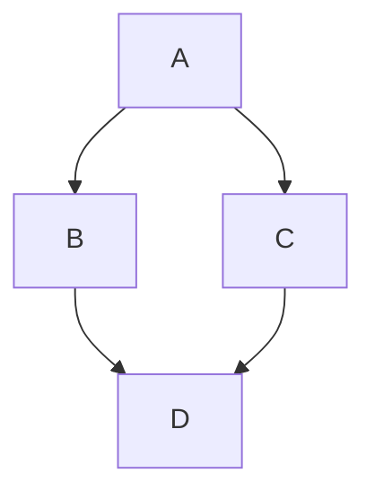

# Data Module

## Overview
The `data` module serves as the implementation layer for interfaces defined in the domain.
It provides concrete implementations for data sources, repositories,
and other components that handle data management and retrieval.

## Responsibilities
- Implements interfaces from the `domain` or other relevant layers.
- Manages data sources such as local databases, remote APIs, or in-memory caches.
- Provides a single source of truth for data handling within the application.

## Structure Module Dependencies
